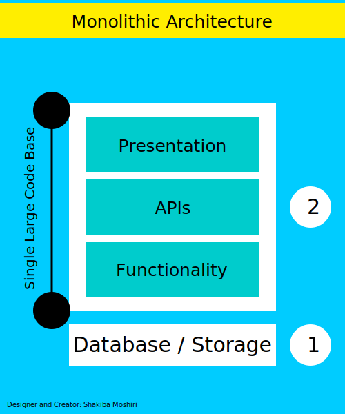
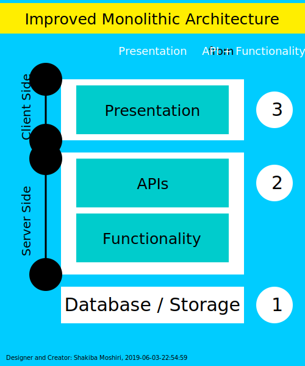
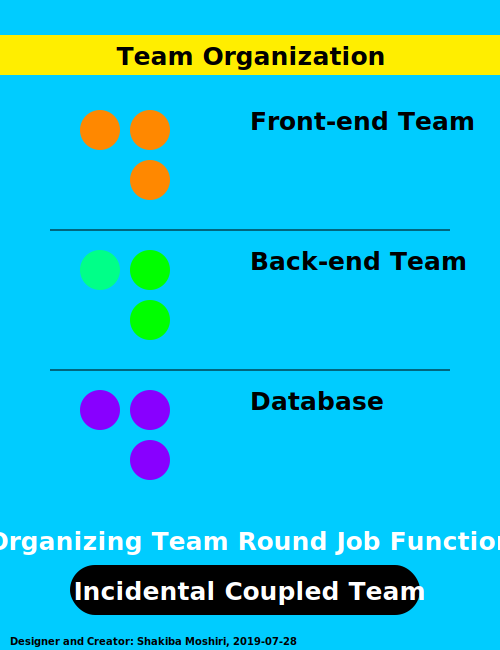
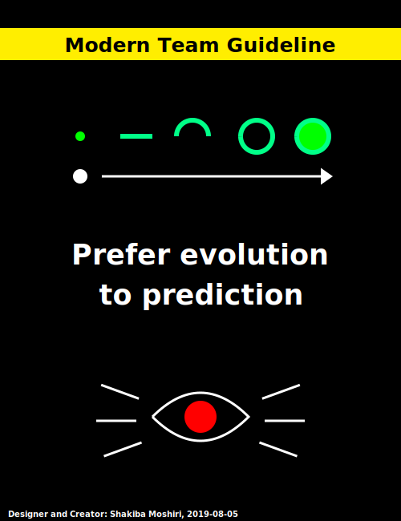

# svg-diagram
Educational purpose SVG diagrams

These are some SVGs I have created for educational purpose.

Some posed on **linkedin.com**, some on my **blogs**, some for classes I had to visualize confusing concepts for my students, and some to visualize it to **myself**.

They are free for **educational** purpose and NOT free for **commercial** purpose unless you pay for them.

<h1 align="center">examples</h1>

  

  

  

  

  

  

